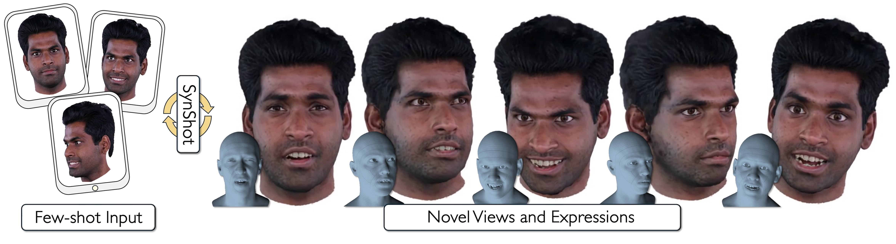

<h2 align="center"><b>SynShot - Synthetic Prior for Few-Shot Drivable Head Avatar Inversion</b></h2>

<h4 align="center"><b>
    <a href="https://zielon.github.io/">Wojciech Zielonka</span><sup>1,2,3*</sup>,
    <a href="http://stephangarbin.com/">Stephan J. Garbin</a><sup>3</sup>,</span>
    <a href="https://alexlattas.com/">Alexandros Lattas</a><sup>3</sup>,</span>
    <br>
    <a href="https://grgkopanas.github.io/">George Kopanas</a><sup>3</sup>,</span>
    <a href="https://www.paulogotardo.com/">Paulo Gotardo</a><sup>3</sup>,</span>
    <a href="https://thabobeeler.com/">Thabo Beeler</a><sup>3</sup>,</span>
    <a href="https://justusthies.github.io/">Justus Thies</a><sup>1,2</sup>,</span>
    <a href="https://sites.google.com/site/bolkartt/">Timo Bolkart</a><sup>3</sup></span>
</b></h4>

<h6 align="center">
    <sup>1</sup><i>Max Planck Institute for Intelligent Systems, Tübingen, Germany</i><br>
    <sup>2</sup><i>Technical University of Darmstadt  </i>
    <sup>3</sup><i>Google</i>
</h6>

<h4 align="center">
<a href="https://youtu.be/4KQQatkaSgc" target="_blank">Video&nbsp</a>
<a href="https://arxiv.org/pdf/2501.06903" target="_blank">Paper&nbsp</a>
<a href="https://zielon.github.io/synshot/" target="_blank">Website&nbsp</a>
</h4>

<div align="center"> 

<i style="font-size: 1.05em;">Official Repository for SynShot - Synthetic Prior for Few-Shot Drivable Head Avatar Inversion</i>
</div>
<br>

## Ablation and comparison to Synshot

In order to compare to our method we release videos for GAN baselines and personalized monocular methods.

The videos were created using the [INSTA dataset](https://github.com/Zielon/INSTA), with the last **600** frames designated as test sequences. 

To evaluate your method:
1. Download the dataset.
2. Train your model while **excluding** the last 600 frames.
3. Use these 600 frames for testing and comparison with **SynShot**.

For **cross-reenactment videos**, in addition to transferring expressions, we also transfer the camera parameters from the source sequence.

### Personalized baselines

Video Order (from left to right):

| **Source/Target** | **Ours** | [**INSTA**](https://github.com/Zielon/INSTA) | [**FlashAvatar**](https://github.com/USTC3DV/FlashAvatar-code) | [**Splatting Avatar**](https://github.com/initialneil/SplattingAvatar) |

In addition to the baseline comparisons, we provide **expression transfer** and **test sequences** for each actor, featuring different numbers of input frames.

📥 **[Download MONOCULAR-BASELINES](https://drive.google.com/drive/folders/1oDFcD6E9TcykPdqq7brl6e9MsCiH4yy1?usp=sharing)**

### GAN-based baselines

Video Order (from left to right):

| **Source/Target** | **Ours** | [**InvertAvatar**](https://github.com/XChenZ/invertAvatar) | [**Portrait4D**](https://github.com/YuDeng/Portrait-4D) | [**Next3D**](https://github.com/MrTornado24/Next3D) |

📥 **[Download GAN-BASELINES](https://drive.google.com/drive/folders/1oDFcD6E9TcykPdqq7brl6e9MsCiH4yy1?usp=sharing)**


### Citation
If you use this project in your research please cite SynShot:
```bibtex
@inproceedings{zielonka2025synshot,
    title={Synthetic Prior for Few-Shot Drivable Head Avatar Inversion},
    author={Wojciech Zielonka and Stephan J. Garbin and Alexandros Lattas 
                    and George Kopanas and Paulo Gotardo and Thabo Beeler 
                    and Justus Thies and Timo Bolkart},
    booktitle = {Proceedings of the IEEE/CVF Conference on Computer Vision and Pattern Recognition (CVPR)},
    month = {June},
    year={2025},
}
```

*Work done while Wojciech Zielonka was interning at Google Zurich